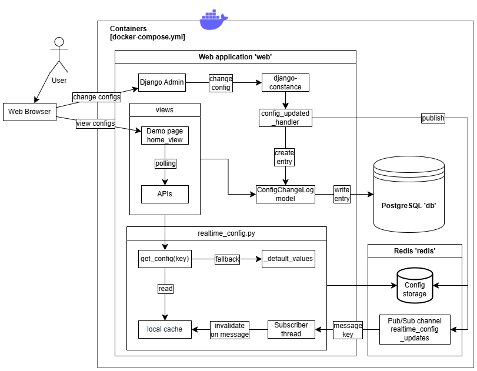

# realtime-configs-task
 
Configuration management system that allows to define realtime configurations and modify them via Django Admin panel - new values are applied without restarting web server.

Built with Django, [django-constance](https://github.com/jazzband/django-constance) library on Redis backend, and PostgreSQL to store config change history.

Better than just using django-constance due to local caching enabling for faster realtime, and fault tolerance to Redis unavailability for main application.

## Features

- Store realtime configurations in Redis and update in Django Admin panel via django-constance
- Local thread-safe in-memory caching to allow for nearly instant realtime update via Redis Pub/Sub
- Fallbacks on Redis unavailability - application works using cache and defaults
- Demo-page viewing configuration values and updates
- All changes to realtime configuration are logged to DB and viewable on demo-page and in Admin
- Complete Docker environment setup with three services: Django web, PostgreSQL, Redis
- Comprehensive logging
- Automatic retries on Redis connection failures, re-connection, and config values recovery
- Integratable with Celery workers (see [project with Celery tasks](https://github.com/ThreightEE/simple-activity-logger))

## Stack

- Python 3.x
- Docker & Docker Compose
- Django as web framework
- Django Constance library
- Redis as backend for Constance and for messaging to workers
- PostgreSQL for users (Admin panel) and config change logs
- MyPy
- HTML, JavaScript for demo page UI

## Architecture

## Quick Start

0. rename .env.example file to .env (modify accordingly)
1. docker-compose up -d --build\
   (docker-compose up --build to watch logs)
2. docker-compose exec web python manage.py migrate
3. docker-compose exec web python manage.py createsuperuser

### Network

- Application - page viewing realtime config values and update history: [http://localhost:8000/]()
- Admin panel: [http://localhost:8000/admin]()

## How this works

### Define config

CONSTANCE_CONFIG in settings.py.\
Also mention your new realtime config in some entry in CONSTANCE_CONFIG_FIELDSETS.

### Get config

from config_app.realtime_config import get_config\
title = get_config('SITE_NAME', default='Default Value')

Default value will be used if Redis is down and local cash is empty.\
If not specified, default from CONSTANCE_CONFIG definition will be used in this case.

#### Caching and fault tolerance

When you call get_config('Key', default_val):
1. If config value is present in local in-memory cache, it will be returned from there.\
   Local cache for 'key' is only invalidated when constance signals on value update for this 'key'.
2. Otherwise, the value is asked for in Redis, and is returned if no errors occur.
3. Otherwise, default_val is returned for the next 10s (change in realtime_config.py).\
   Automatically will reconnect to Redis and Redis Pub/Sub channel when Redis is up again. 
4. If default_val, which is optional, isn't specified, CONSTANCE_CONFIG default is returned.

#### Update mechanism

0. When application starts, a background thread is subscribed to Redis Pub/Sub channel for each worker process.
1. When config is changed in Admin, django-constance emits config_updated signal, and the handler publishes 'key' of this config to Redis Pub/Sub channel.
2. The thread receives this message and invalidates value for 'key' in local cache, forcing get_config() to fetch the new value from Redis via constance the next time.

#### Logging

0. The handler for config_updated signal also creates entry in the DB storing key, old value, new value, and timestamp.
1. Theoretically, this can be further improved to fetch values from the last DB entries when both Redis is unavailable and local cache is empty, instead of defaults. And include user who changed the value. Initially this was just a history log feature.

### Gunicorn

For this to work with Gunicorn you only switch command in docker-compose.yml.

### Celery

For this to work with Celery you need to add the following to your celery.py:\
import realtime_config.celery_init

You can check that it works (and how it works) [here](https://github.com/ThreightEE/simple-activity-logger).

## Possible enhancements

- Deploy with Gunicorn instead of runserver
- Replace JS polling made for demo purposes with WebSockets/SSE for real-realtime
- Redis Pub/Sub doesn't guarantee the message, so some synchronisation can be done. Also, currently, if subscriber unavailable for some reason (this doesn't happen in this simple project), it will not receive 'passed' messages when it was down - make fault tolerance for this.
- Disk snapshot can periodically be made to guarantee fresh values if Redis is down.
- Some configs may depend on each other, so it would be good to add a possibility to group such configs and make invalidations for the corresponding cache nearly 'at the same moment' to prevent inconsistency.
- Monitoring is not integrated here.

## Testing

You can run a few (three) tests for get_config() function :)\
docker-compose exec web python manage.py test config_app
